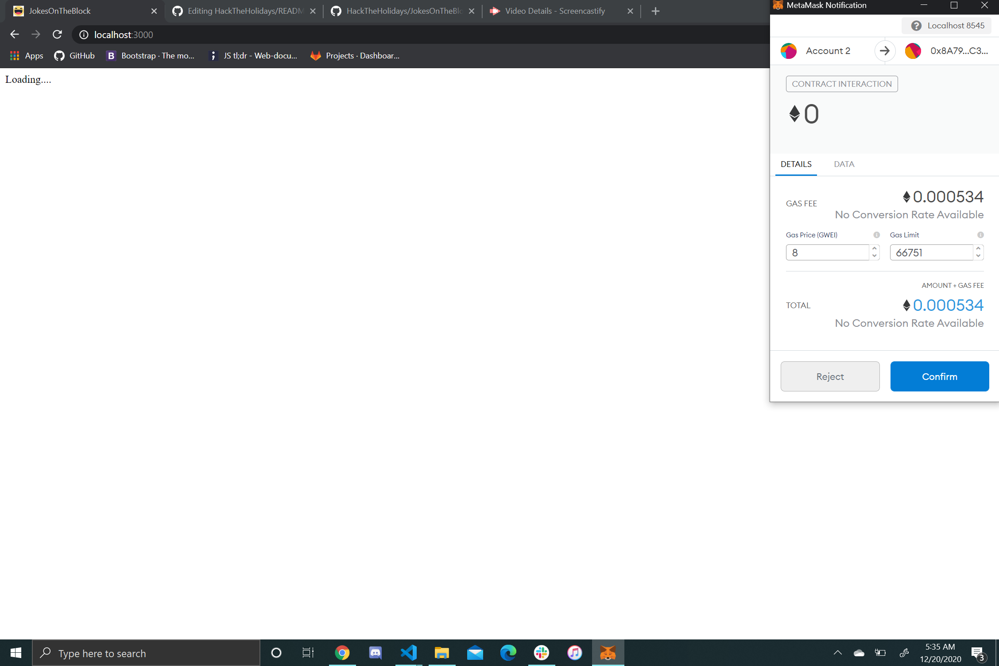

# Jokes on the Block

## Summary

### User Story
2020 has been a year of anything but normal. With the levels of depression increasing due to these economic and social issues. I wanted a place to where a user could read some quick jokes and maybe leave this web application better than when they it first rendered. Users have an option to add a new joke and also vote on existing jokes.

## Implementation
 - Jokes contract coded using Hardhat and Solidity. 
 - Test cases all passing for the simple functions.
 - Front end created using React
 - Styling using flexbox and basic CSS
 
 ## Visual
   
 YouTube Link: https://youtu.be/EqwUtdb4yzU  
 On Loading Screens, metamask wallet is up but not shown in videos 
  
# HackTheHolidays
This repository is for the participants and viewers of the 2020 HackTheHolidays occurring on the 18-20 of December. Please head to https://hackathon.blockchaincenter.com to register.

